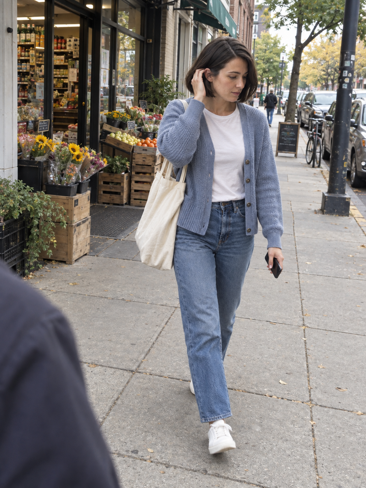
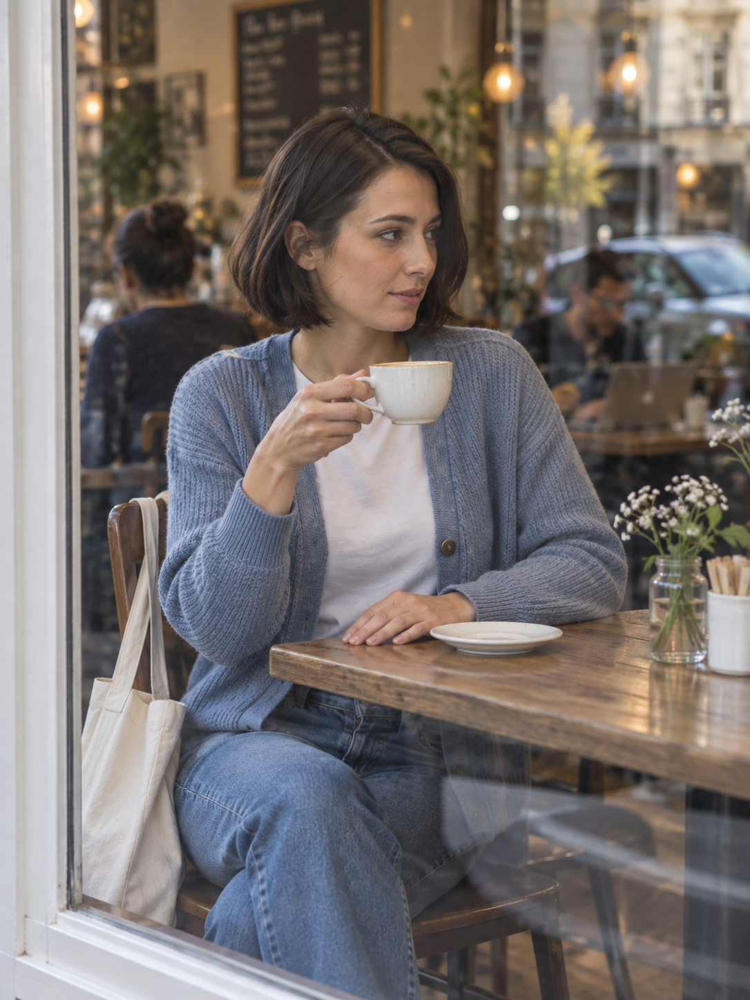
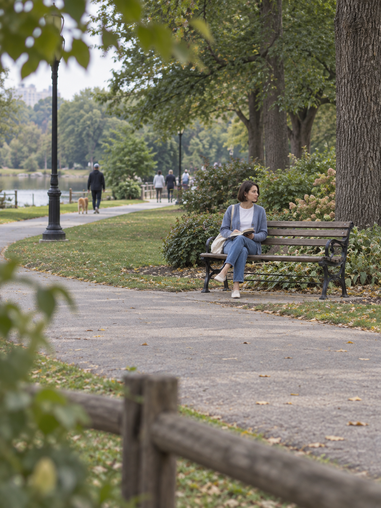

# 原创人物实测样例

四张均为 AI 生成的虚构成年人物与公共场景，没有使用用户提交的人物照片。前三张是初版测试，第四张是rc2新增远景的独立测试。第一张从文字创建人物，其余各张均直接引用第一张，未采用逐代接力。

用户请求：30岁短发女性，深棕齐下巴短发，雾蓝针织开衫、白T恤、直筒牛仔裤、白色运动鞋、帆布包；三个日常场景，其中一张手机随手拍。

| 书店翻页 | 街道手机快拍 | 隔窗咖啡店 |
|---|---|---|
|  |  |  |
| [实际提示词](01-prompt.txt) | [实际提示词](02-prompt.txt) | [实际提示词](03-prompt.txt) |

工具：Codex 内置 image_gen；模型名称与种子未提供。每张本轮调用1次，未额外重试或视觉修正。输出均为1086×1448 PNG，没有后期合成或修图。

## rc2新增远景

[实际提示词](04-prompt.txt)。在独立上下文执行修订Skill，仅附第一张参考，要求同人物同衣服的公园远景。人物头至鞋高度目测约四分之一，前景木栏杆与树叶、中间空地和远处长椅形成空间层次。远景五官信息有限，不能声称与近景有同等人脸细节；首张看不到鞋，无法从该参考核对鞋款。

可见保留项：手机图仍偏精致；咖啡店实际取景比原设计更宽。只有街道全身图展示了鞋子，不能因为另外两张没拍到鞋就宣称逐件服装都已验证。

示例图片不纳入仓库的软件 MIT 许可证。它们用于展示本次测试效果，不代表对任意人物或模型的成功率承诺。

